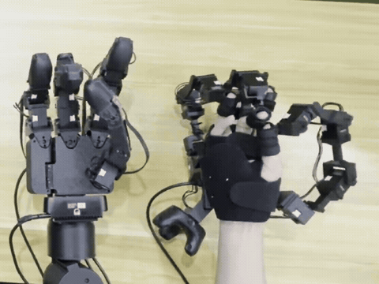
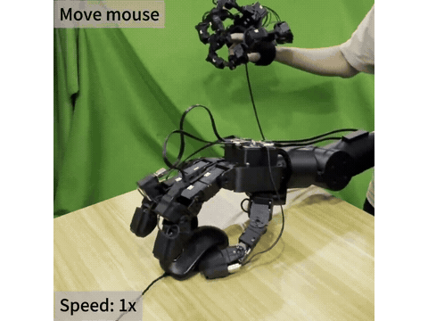

# GEX16

[主页](https://prevalenter.github.io/gexpro/) | [文档](https://prevalenter.github.io/GEXPRO-docs/) | [English](README.md)

 [](docs/media/teleop.mp4)  [](docs/media/mouse.mp4) |


## 安装

使用 Python 3.10 或更新版本：

```sh
python -m pip install -e '.[visualization]'
```

基础安装 `pip install -e .` 提供硬件驱动和 ZMQ。
真机遥操作需要 Linux/CUDA 环境和适合机器的 CUDA PyTorch，再安装 `.[retarget]`。
真机遥操作仍默认要求 CUDA；离线测试查看器安装 `.[retarget-viewer]`，
可使用 CPU，不需要 SAPIEN。测试依赖安装 `.[dev]`。

## 真机与可视化

分别在三个终端运行，替换为实际串口：

```sh
python src/ex16.py --port /dev/ttyUSB0
python src/gx16.py --port /dev/ttyUSB1
python src/viewer.py
```

也可用 `--serial-number` 替代 `--port`。访问终端显示的 Viser 地址，默认
`127.0.0.1:8080`。两个模型均显示**真机测量角度**，不是模拟状态或预测状态。

两个 base 均有平移/旋转 gizmo。展开 **Base poses**，点击 **Save bases** 保存，
**Reload bases** 重新加载，**Reset bases** 恢复默认布局但不自动保存。
位置与 RPY 数值输入和 gizmo 双向同步；**Gizmos** 仅控制操作柄显示，不隐藏模型。
默认保存到 `~/.local/share/gex16/base_poses.json`，启动时自动读取，
也可通过 `--base-poses /path/to/bases.json` 指定文件。
这些位姿只影响显示，不修改标定或硬件命令。

**GX16 初始化会使能扭矩。** 连接前核实接线、电机 ID、方向、机械零位和电流/PWM
设置，并准备物理断电手段。

## 重定向

仓库已包含 **GEX Retarget** 模型及配套示例数据，位置为：

```text
src/resources/retarget/
  last.pth       # 训练好的 IK 权重
  config.json    # 配套关节顺序、关键点映射与限位
  calibration.npz # EX16 标定与原始关节样本
  reference.npy   # 匹配的人体手部关键点参考数据
```

两个入口默认加载这些文件，安装 wheel 后也能使用包内模型和数据，
示例不再需要仓库外路径。使用其他匹配数据时，可通过 `--checkpoint-dir`、
`--calibration`、`--reference` 覆盖默认值。
内置标定对应现有示例，更换硬件配置时仍需检查标定是否适用。

### 真机遥操作

先启动 EX16 发布端，再使用仓库内的模型和示例数据：

```sh
python src/teleop.py --checkpoint-dir src/resources/retarget \
  --calibration src/resources/retarget/calibration.npz \
  --reference src/resources/retarget/reference.npy
```

默认仅在 Viser 中预览。控制真机时先启动 `gex-gx16`，再添加
`--enable-gx16-output`。同时运行 `gex-view` 时，用不同的 `--port-viser`。
标定读取是推理依赖，因此保留；不再提供标定采集或数据生成工具。


### Viser 遥操作测试

无需连接设备或启动 ZMQ 发布端，在仓库根目录直接执行：

```sh
python -m pip install -e '.[retarget-viewer]'
python src/retarget_viewer.py
```

显式指定仓库内路径的等价命令为：

```sh
python src/retarget_viewer.py \
  --checkpoint-dir src/resources/retarget \
  --calibration src/resources/retarget/calibration.npz \
  --reference src/resources/retarget/reference.npy \
  --device auto \
  --port-viser 8081
```

访问 `127.0.0.1:8081`。按手指分组的 16 个滑动条控制 EX16 关节角度，单位为度，
范围取自 EX16 URDF；GX16 实时显示 GEX Retarget 输出，并按权重中的关节限位裁剪。
**Zero joints** 归零，**Calibration pose** 恢复标定姿态。
测试界面与 `viewer.py` 共用 base gizmo 和位姿文件；需要独立布局时指定不同的
`--base-poses` 文件。

点击 **Save initial joints**，将当前 16 个滑动条角度保存为初始姿态；
**Reload initial joints** 可立即恢复，不需要重启。
默认文件为 `~/.local/share/gex16/ex16_initial_pose.json`，可用 `--initial-pose` 指定。
下次启动优先读取已保存姿态；文件不存在或无效时使用标定姿态，无效文件会显示错误。
关节姿态和 base 位姿分开保存，base 需点击 **Save bases**。
两种保存操作均不修改标定文件、权重或硬件状态。

`--device auto` 优先 CUDA，不可用时使用 CPU；`--device cpu` 强制 CPU 推理。
该工具没有硬件输出入口，不进行平滑或碰撞仿真，用于检查模型映射，不代表实机运动安全。

## 代码结构

```text
src/
  ex16.py          # Glove16 驱动与 EX16 发布端
  gx16.py          # Hand16 驱动与 GX16 命令/状态服务
  viewer.py        # 真机状态可视化
  teleop.py        # GEX Retarget 控制循环与 Viser 预览
  retarget_viewer.py # 离线 EX16 滑动条 -> 重定向 -> GX16
  device.py        # 串口连接与清理
  motor.py         # 必要电机寄存器操作
  transport.py     # ZMQ 消息与 GX16Client
  retargeting/     # 投影、模型加载、平滑
  resources/       # URDF、mesh、模型与示例标定/参考数据
  _vendor/         # 必要的第三方 SDK 与推理代码
```

Python API：`from ex16 import Glove16`、`from gx16 import Hand16`。
`Glove16.getjs()` 使用 URDF 角度；`Hand16.getjs/setjs()` 使用电机相对角度。
两个驱动均提供 `connect()`、`close()`，应始终在 `finally` 中关闭硬件。
ZMQ 命令通过 `transport.GX16Client.request()` 调用，
`get_qpos/set_qpos` 使用 URDF 弧度。不要让多个进程同时打开同一设备。

核心代码直接放在 `src/`，不增加额外包目录；文档、测试和项目配置留在仓库根目录。
在仓库根目录运行 `python src/<module>.py`，或安装后使用 `python -m <module>`。
安装后可使用 `gex-ex16`、`gex-gx16`、`gex-view`、`gex-teleop`、`gex-retarget-view`，
均支持 `--help`。资源按代码所在位置定位，不依赖当前工作目录。
见 [协议与输入文件](docs/protocol.zh-CN.md) / [English](docs/protocol.md)。
`python -m pytest` 使用注入的测试设备对象，不连接真机。
实机和完整 Linux/CUDA/SAPIEN 验收仍需单独完成。

## 致谢

感谢 GeoRT 为我们的 retarget 开发提供了基础。
